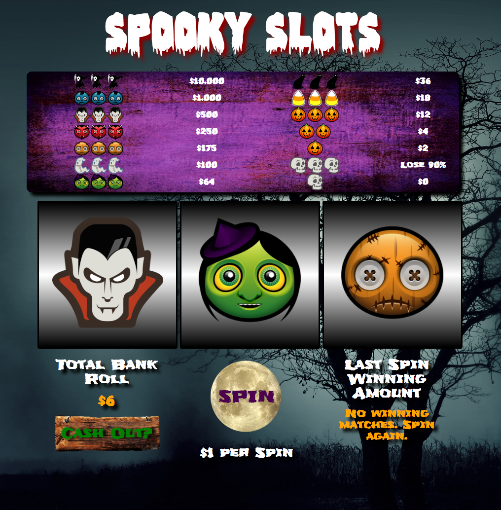

# _Spooky-Slots_

#### _An interactive web app that recreates a pull slot machine game._

#### By _**Adam Craig, Tommy Jones, Nick Lyman, and Ashley Maceli**_

## Description

_An interactive web app that allows a user to spin the reels of a virtual slot machine. Stores a coinpurse that dictates
winnings and how many pulls are allowed. Incorporates shuffling image effects to simulate spinning slots. Interactive
elements created almost entirely in JavaScript._

##GitHub Pages Link

http://adamcraig.github.io/spooky-slots

## Known Bugs

_On mobile devices (which take longer to load and thus are not properly synced with our timer functions), the slots usually do not show the proper images (i.e images indicate that a user won when they really lost, etc.)._

## Support and contact details

_For all issues and support, please contact:
* _Adam Craig at ajcraig@suffolk.edu_
* _Tommy Jones at tommyinseason@yahoo.com_
* _Nick Lyman at nick.lyman@gmail.com_
* _Ashley Maceli at ashley.maceli@gmail.com_

## Technologies Used

_HTML, CSS, Bootstrap, JavaScript, jQuery_

### License

The MIT License (MIT)

Copyright (c) [2016] [Adam Craig, Tommy Jones, Nick Lyman, Ashley Maceli]

Permission is hereby granted, free of charge, to any person obtaining a copy
of this software and associated documentation files (the "Software"), to deal
in the Software without restriction, including without limitation the rights
to use, copy, modify, merge, publish, distribute, sublicense, and/or sell
copies of the Software, and to permit persons to whom the Software is
furnished to do so, subject to the following conditions:

The above copyright notice and this permission notice shall be included in all
copies or substantial portions of the Software.

THE SOFTWARE IS PROVIDED "AS IS", WITHOUT WARRANTY OF ANY KIND, EXPRESS OR
IMPLIED, INCLUDING BUT NOT LIMITED TO THE WARRANTIES OF MERCHANTABILITY,
FITNESS FOR A PARTICULAR PURPOSE AND NONINFRINGEMENT. IN NO EVENT SHALL THE
AUTHORS OR COPYRIGHT HOLDERS BE LIABLE FOR ANY CLAIM, DAMAGES OR OTHER
LIABILITY, WHETHER IN AN ACTION OF CONTRACT, TORT OR OTHERWISE, ARISING FROM,
OUT OF OR IN CONNECTION WITH THE SOFTWARE OR THE USE OR OTHER DEALINGS IN THE
SOFTWARE.
